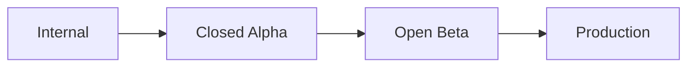

# Google Play Console Setup Guide - EchoTrail

## 1. Google Play Developer Account Setup

### Prerequisites
- Google account
- $25 USD one-time registration fee
- Valid credit card for payments
- Government-issued ID for account verification

### Steps
1. Go to [Google Play Console](https://play.google.com/console)
2. Pay the one-time $25 developer registration fee
3. Complete identity verification
4. Accept the Play Console Developer Distribution Agreement

## 2. App Registration

### Basic App Information
- **App Name:** EchoTrail - AI Guidede Turer
- **Default Language:** Norwegian (Norge)
- **App Category:** Maps & Navigation
- **Tags:** Hiking, GPS, AI, Offline Maps, Norway

### App Declaration
- ✅ This is an app (not a game)
- ✅ This app is free to download
- ✅ Contains in-app purchases/premium features
- ❌ Does not contain ads

## 3. Store Listing Configuration

### Main Store Listing
```
App Name: EchoTrail - AI Guidede Turer
Short Description: AI-drevet turassistent med stedsspesifikke historier og offline kart
Full Description: [Use content from store-listing.md]
```

### Contact Details
- **Email:** support@zentric.no
- **Website:** https://zentric.no
- **Privacy Policy URL:** https://zentric.no/echotrail/privacy

### App Category & Tags
- **Category:** Maps & Navigation
- **Tags:** hiking, ai, gps, offline maps, norway, navigation, trails, outdoor

## 4. App Content Rating

### Questionnaire Responses
- **Target Age Group:** 13+
- **Violence:** None
- **Sexual Content:** None
- **Profanity:** None
- **Controlled Substances:** None
- **Gambling:** None
- **Location:** Yes (core functionality)

### Expected Rating
- **ESRB:** Everyone (E)
- **PEGI:** 3
- **USK:** 0

## 5. App Permissions & Data Safety

### Sensitive Permissions
| Permission | Purpose | User-Facing Description |
|------------|---------|------------------------|
| ACCESS_FINE_LOCATION | Core navigation features | "EchoTrail uses your precise location to provide GPS navigation and location-based AI stories" |
| ACCESS_BACKGROUND_LOCATION | Continuous tracking during hikes | "Background location is used only during active hiking sessions to maintain navigation" |
| CAMERA | Trail photography | "Camera access allows you to take photos and associate them with your trails" |
| READ_MEDIA_IMAGES | Photo management | "Photo access enables you to add existing photos to your trail memories" |

### Data Safety Declaration
```yaml
Data Collection:
  Personal Info:
    - Email address (optional, for account creation)
    - Name (optional, for personalization)
  
  Location:
    - Precise location (required for core functionality)
    - Approximate location (for general area recommendations)
  
  Photos and Videos:
    - Photos (optional, user-generated trail documentation)
  
  Device Info:
    - Device identifiers (for analytics and crash reporting)
    - App performance data (for improvements)

Data Sharing:
  - Location data may be shared with OpenAI API (anonymized when possible)
  - No personal data sold to third parties
  - Analytics data shared with service providers (anonymized)

Data Security:
  - Data encrypted in transit and at rest
  - Follows industry security standards
  - Regular security audits conducted
```

## 6. Release Management

### Release Tracks
1. **Internal Testing** (Team only)
2. **Closed Testing** (Alpha - Selected testers)
3. **Open Testing** (Beta - Public opt-in)
4. **Production** (General availability)

### Release Process


### Rollout Strategy
- **Internal:** 100% immediately
- **Alpha:** 10 selected testers
- **Beta:** 100 public beta users
- **Production:** Gradual rollout (1% → 5% → 25% → 100%)

## 7. App Bundle Configuration

### Build Configuration
```json
{
  "bundleType": "AAB (Android App Bundle)",
  "targetSdk": 35,
  "minSdk": 24,
  "versionCode": 1,
  "versionName": "1.0.0",
  "architecture": ["arm64-v8a", "x86_64"]
}
```

### Signing Configuration
- Use Google Play App Signing (recommended)
- Generate upload key separately from app signing key
- Store keys securely with proper backup

## 8. App Signing Setup

### EAS Build Integration
```bash
# Generate upload key for Google Play
eas credentials -p android

# Configure upload key in eas.json
"android": {
  "serviceAccountKeyPath": "./android-service-account.json"
}
```

### Service Account Setup
1. Create service account in Google Cloud Console
2. Download JSON key file
3. Add service account to Google Play Console with appropriate permissions
4. Store JSON file securely (not in version control)

## 9. Store Assets Checklist

### Required Assets
- [ ] **App Icon** (512×512 PNG, <1MB)
- [ ] **Feature Graphic** (1024×500 PNG, <15MB)
- [ ] **Phone Screenshots** (2-8 images, 16:9 ratio)
- [ ] **Tablet Screenshots** (1-8 images, 16:10 ratio)

### Optional but Recommended
- [ ] **Promo Video** (YouTube link, 30-120 seconds)
- [ ] **TV Banner** (if Android TV support added)

### Screenshot Specifications
```
Phone Screenshots:
- Size: 1080×1920, 1080×2160, or 1080×2340
- Format: PNG or JPEG
- Maximum: 8 screenshots
- Show actual app functionality

Tablet Screenshots:
- Size: 2560×1600 or 2880×1800
- Format: PNG or JPEG
- Recommended: 2-4 screenshots
```

## 10. Compliance Checklist

### Google Play Policies
- [x] **Restricted Content:** No restricted content
- [x] **Spam:** Original, high-quality app
- [x] **Security:** No malicious behavior
- [x] **Privacy:** Proper data handling and privacy policy
- [x] **Permissions:** Only necessary permissions requested
- [x] **Background Processing:** Properly justified and disclosed

### Additional Requirements
- [x] **Target API Level:** Targeting Android 15 (API 35)
- [x] **App Bundle:** Using AAB format
- [x] **Testing:** Thoroughly tested on various devices
- [x] **Accessibility:** Basic accessibility features implemented

## 11. Pre-Launch Checklist

### Technical Verification
- [ ] App builds successfully with EAS Build
- [ ] All features work offline
- [ ] Location permissions work correctly
- [ ] AI features integrate properly with OpenAI API
- [ ] Database operations work reliably
- [ ] App handles network interruptions gracefully

### Content Verification
- [ ] All text is properly translated (Norwegian/English)
- [ ] Screenshots show actual app functionality
- [ ] Privacy policy is accessible and accurate
- [ ] Terms of service are comprehensive
- [ ] Contact information is correct and responsive

### Testing Verification
- [ ] Internal testing completed
- [ ] Alpha testing feedback incorporated
- [ ] Beta testing ready for launch
- [ ] Performance testing on various devices
- [ ] Battery usage optimized

## 12. Launch Strategy

### Phase 1: Internal Testing (Week 1)
- Upload AAB to internal track
- Test all core functionalities
- Verify store listing appears correctly
- Check download and installation process

### Phase 2: Closed Testing (Week 2-3)
- Invite 10-20 selected testers
- Gather feedback on user experience
- Test location accuracy in different areas
- Validate AI content generation quality

### Phase 3: Open Beta (Week 4-6)
- Launch public beta with 100-500 users
- Monitor crash reports and performance metrics
- Iterate based on user feedback
- Prepare marketing materials

### Phase 4: Production Launch (Week 7+)
- Gradual rollout starting at 1%
- Monitor key metrics and user feedback
- Scale to 100% over 7-14 days
- Execute marketing and PR plan

## 13. Post-Launch Monitoring

### Key Metrics to Track
- **Install Rate:** Downloads per store listing view
- **Retention Rate:** Day 1, 7, 30 retention
- **Crash Rate:** Should stay below 0.1%
- **ANR Rate:** Should stay below 0.05%
- **Rating & Reviews:** Target 4.0+ stars
- **User Feedback:** Respond to reviews within 24-48 hours

### Update Schedule
- **Critical Fixes:** Within 24-48 hours
- **Minor Updates:** Bi-weekly
- **Major Features:** Monthly
- **Seasonal Content:** Quarterly

---

## Contact Information

**Developer Support:** support@zentric.no  
**Business Inquiries:** business@zentric.no  
**Press & Media:** press@zentric.no

---

*This setup guide ensures compliance with Google Play policies and Norwegian business regulations.*